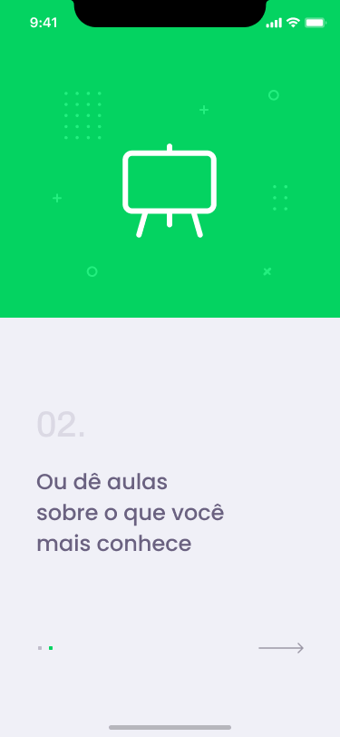

<p align="center">
   
</p>

<p align="center">    
   <a href="https://www.linkedin.com/in/carolinegoulart/">
      
   </a>
  <a href="https://github.com/carolinegoulart/proffy-web-and-mobile-application/commits/master">
    
  </a> 
  
  <a href="https://github.com/carolinegoulart/proffy-web-and-mobile-application/stargazers">
    
  </a>
</p>

> :rocket: This project has been developed in the bootcamp NextLevelWeek #2 by @Rocketseat.


# :pushpin:  Table of Contents

* [Demo Website](#eyes-demo-website)   
* [Technologies](#computer-technologies)
* [Features](#rocket-features)
* [How to Run](#construction_worker-how-to-run)
* [Found a bug? Missing a specific feature?](#bug-issues)
* [License](#closed_book-license)

<h2 align="left"> 📥  Layout </h2>

### Web Screenshot
<div>
   
   
</div>

### Mobile Screenshot
<div>
   
   
   
   
</div>

# :eyes: Demo Website
You can acess the website at:     
👉  demo: available soon!

[]()      


# :computer: Technologies
This project was made using the follow technologies:

* [Typescript](https://www.typescriptlang.org/)      
* [React](https://reactjs.org/)      
* [Expo](https://expo.io/)       
* [Express](https://expressjs.com/)      

# :rocket: Features

* Website to sign up teachers and students.
* App to connect teachers and students.

# :construction_worker: How to run
```bash
# Clone Repository
$ git clone https://github.com/carolinegoulart/proffy-web-and-mobile-application.git
```
### 📦  Running the API

```bash
# Go to server folder
$ cd Proffy/server

# Install Dependencies
$ yarn install

# Run Aplication
$ yarn start
```
Access API at http://localhost:3333/

### 💻  Running the Web Project

```bash
# Go to web folder
$ cd Proffy/web

# Install Dependencies
$ yarn install

# Run Aplication
$ yarn start
```
Go to http://localhost:3000/ to see the result.

### 📱  Running the Mobile Project
To run the mobile project you need a cellphone with the app of [expo](https://play.google.com/store/apps/details?id=host.exp.exponent) instaled or a emulator android/ios.
<br />
After, fork this repository and clone to your machine. Inside of the project's folder run the following commands:

```bash
# Go to mobile folder
$ cd Proffy/mobile

# Install Dependencies
$ yarn install

# Run Aplication
$ yarn start
```
Aferter read the QRCode with the app of [expo](https://play.google.com/store/apps/details?id=host.exp.exponent) or run on emulator.


# :bug: Issues

Feel free to **file a new issue** with a respective title and description on the the [Proffy](https://github.com/carolinegoulart/proffy-web-and-mobile-application/issues) repository. If you already found a solution to your problem, **i would love to review your pull request**!

# :closed_book: License

Released in 2020 :closed_book: License

Made with love by [Caroline Goulart](https://github.com/carolinegoulart) 🚀.
This project is under the [MIT license](./LICENSE).


Give a ⭐️  if this project helped you!
